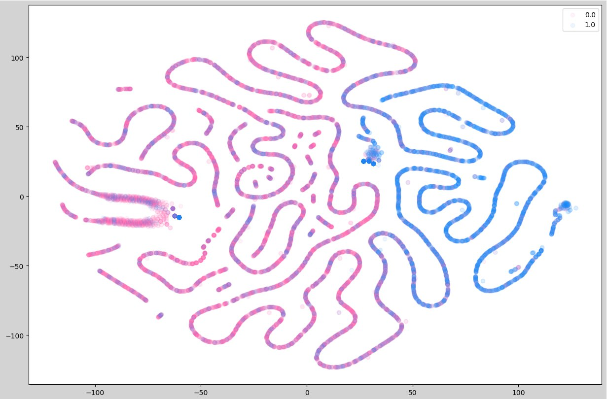

# Prediction of industrial cyber attacks using embeddings
This model is trained for embeds using triplet loss. Embeddings use a GradientBoostingClassifier to detect anomalies.

## Implemented models
- TripletLossModel
- TripletDataset

## Basic usage


Запустить эксперимент
```python
python run_experiment.py
```
## Results
TSNE-2d plots trained on pure features and embeddings respectively: 


## Metrics


